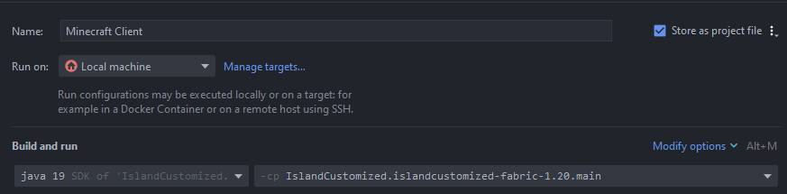
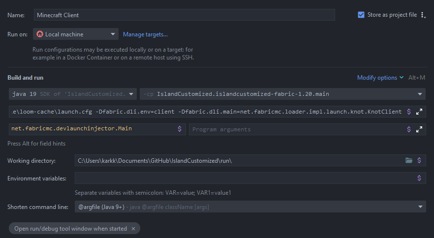

# IslandCustomized

    
    
    

    
    

    Customization &amp; utility mod for MCC Island

    
    
    

# IMPORTANT

Currently IslandCustomized is very limited. We recommend using  [**Mod
Menu**](https://modrinth.com/mod/modmenu/version/7.0.1) for the configurating.
Alternatively, you can do `/owo-config islandcustomized`. We're working on a better solution.

[**With that being said, you can download the mod
here.**](https://github.com/IcosphereIndustries/IslandCustomized/releases)

We'll publish the mod to Modrinth once it's more complete.

## Features

### Customization

* You can customize the death & victory messages in different gamemodes. More to come.
* Full RGB support. You can use HEX colors in the config by inserting them in the strings
  like this:

HEX colors: `<#ff0000>This is in red!`

[Vanilla codes:](https://www.digminecraft.com/lists/color_list_pc.php) `&c&lThis text is red and bold!`

## Development

### Setup

1. Clone the repository, do the obvious stuff
2. Load the project in your IDE. The project must be built once to generate the required files for our config system.

### Building

There are multiple versions of the project for different versions. You can build a single one by running
`gradlew islandcustomized-<version>:build` in the root directory of the project. Example for f1.20.1: `gradlew islandcustomized-fabric-1.20:build`

### Development Tips
1. In IntelliJ, you can launch a development instance of Fabric by going to the run configurations and creating a new Application configuration. For `-cp`, pick the version that you want to work with.

The VM options should look something like this - remember to change the loom cache path to your own.

`-Dfabric.dli.config=C:\Users\karkk\Documents\GitHub\IslandCustomized\.gradle\loom-cache\launch.cfg -Dfabric.dli.env=client -Dfabric.dli.main=net.fabricmc.loader.impl.launch.knot.KnotClient`

For the main class, use `net.fabricmc.devlaunchinjector.Main`

